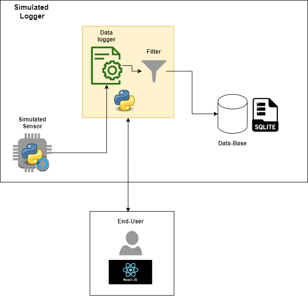
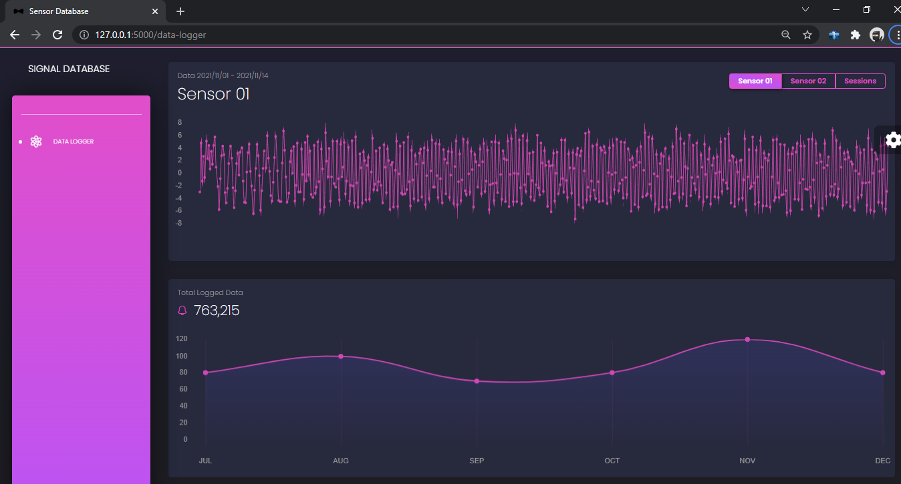
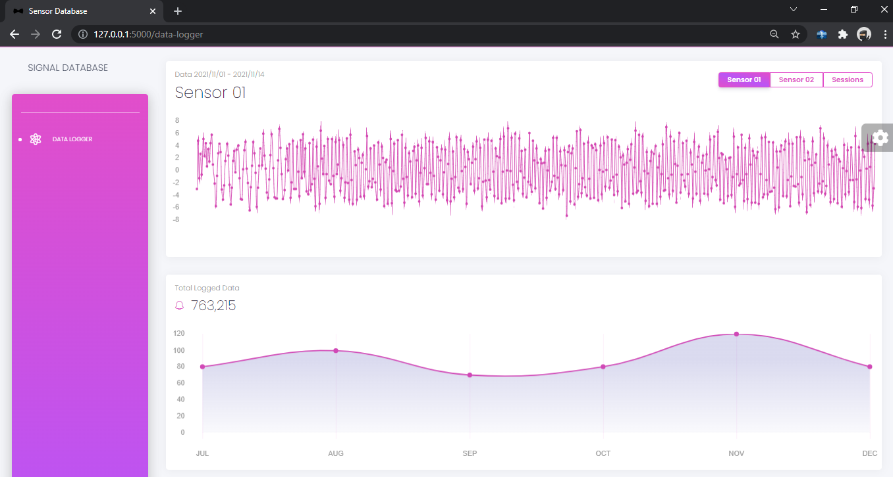

# Signal-DB (Ongoing)

## Introduction
Quick, reliable data logging is a key requirement for tests from component characterization to prolonged endurance testing to the evaluation of large dataset. This project sets out a way to simulate real-world signals collection, filter and store them in a simple database. This project also provides a platform to interact with stored signal data through Web front-end page. The system invloves the following steps:

* Signal collection
* Filtering 
* Storing in local DB
* Visualization through a local Web-server

 

   
  
  ## Examples
  
  

  
  

    
  
    
  

  
  

    
  ## Prerequisites
  
  1. Install SQLite
  2. Install ______
  
  ## Setting Up
  
  1. Make sure SQLite is running
  2. Install dependencies:  pip3 install -r requirements.txt
  3. set FLASK_APP=run.py
  
  ## TASKS YET TO BE ACCOMPLISHED

    Backend
    [Create and simulate Signals ] 
    [Create single database class for different DBMS] 
    [Create MarinaDB database class] 
    [Create SQLite database class] 
    
    [ ] 
    [ ] 

    Frontend
    [Setup FLASK] 
    [Create a live stream of sensor data recored] 
    [ ] 
    [ ] 
  
  ## License
  
  Private
  
  ## Authors
  
  Solomon Gugsa (private work)
  
  ## Version
  
  Initial
  
